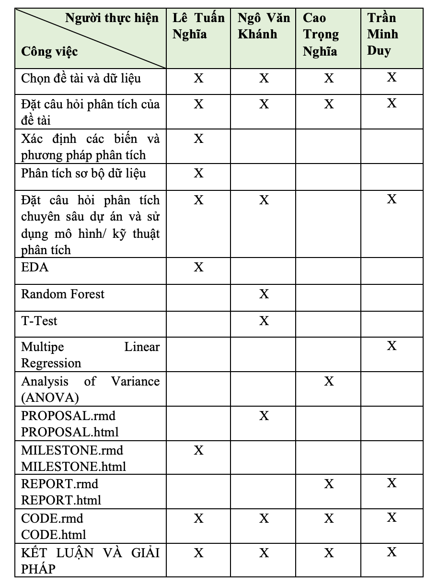

```{r setup, include=FALSE}
knitr::opts_chunk$set(echo = TRUE)
```

### Tên đề tài :
#                        Students Performance in Exams

                                                        **Proposal**

```{r}
library(tidyverse)
library(knitr)
```


#1. Giới thiệu

-  Cụm từ “học sinh - sinh viên” đã không quá xa lạ đối với xã hội hiện nay. Học sinh - sinh viên là những đối tượng đang được hướng dẫn dưới sự giáo dục của nhà trường và gia đình.
	- Học sinh - sinh viên là những đối tượng tạo nên tương lai của đất nước. Đi kèm với đó là những thành tích mà các bạn đạt được thông qua các kỳ thi, là nơi mà các bạn thể hiện được kết quả học tập của bản thân. Đó cũng là chủ 	   đề của nhóm em. 
	- Nhằm mục tiêu nghiên cứu các yếu tố xung quanh có ảnh hướng đến đến thành tích của học sinh - sinh viên hay không? Từ việc thu thập thành tích và các yếu tố liên quan, từ đó đưa ra kết luận và đưa ra giải pháp để nâng cao 	   giáo dục thời nay.

#2.Dữ liệu:
	- Nguồn dữ liệu:Dữ liệu này được trích xuất từ website kaggle                                               https://www.kaggle.com/datasets/spscientist/students-  performance-in-exams 
	
	- Dữ liệu trên gồm tập hợp của các bộ dữ liệu được thu thập từ các trường trung học tại Hoa Kì. Với 5 biến, tổng 1000 quan sát để làm yếu tố, giải thích cho thành tích của học sinh - sinh viên và 4 biến (math_score, reading_score, writing_score, total_score)là biến để biểu diễn thành tích cuối cùng đạt được của học sinh- sinh viên.
	
	  
## biến quan sát (X): gender
                    race.ethnicity
                    parental_level_of_education
                    lunch
                    test_preparation_course
                    
## biến kết quả(Y): math_score
                    reading_score
                    writing_score
                    total_score biến được tạo thêm
                    
    
                    
##- Mô tả và ý nghĩa:
	    gender: giới tính. 
	    
			race/ethnicity: chủng tộc / dân tộc.  
			
			parental_level_of_education: Trình độ học vấn gia đình.
			
			lunch: Ăn trưa trước khi vào kỳ thi.
			
			test_preparation_course: Tham gia các khóa luyện thi trước kỳ thi. 
			
			math_score: điểm toán.     
			
			reading_score: điểm đọc .   
			
			writing_score: điểm viết.
			
			total_score: điểm trung bình. (Giúp dễ dàng hơn trong việc trực quan hóa dữ liệu) biến được tạo thêm
			
#3.Thư viện và các gói sử dụng
  library(highcharter)
  library(corrplot)
  library(randomForest)
  library(caTools)
  library(ROCR)
  library(e1071)
  library(DAAG)
  library(party)
  library(rpart)
  library(rpart.plot)
  library(mlbench)
  library(pROC)
  library(tree)
  library(htmlwidgets)
  library('IRdisplay')
  library(dplyr)
  library(tidyr)
  library(ggplot2)
  library(tidyverse)
  library(ranger)
  library(ggpubr)
  library(naniar)
  library(car)
  library(caret)
  library(parsnip)
  

#4. Kế hoạch phân tích dữ liệu
## 1 Phân tích EDA và trực quan hoá đồ thị để hiểu thêm tập dữ liệu và phục vụ cho công việc phân tích
* Ý nghĩa: Hiểu bộ dữ liệu mà nhóm sử dụng và trực quan hoá đồ thị phục vụ cho việc phân tích, đặt ra các câu hỏi để phân tích dự án và áp dụng các mô hình phân tích tốt nhất


## 2 Thống kê tất cả các biến số có trong tập dữ liệu và đưa ra sự chênh lệch giữa các nhóm với nhau.
* Biến dự đoán (X): gender, race/ethnicity, test_preparation_course, lunch, parental_level_of_education.

* Biến giải thích(Y): gender, race/ethnicity, test_preparation_course, lunch, parental_level_of_education.

* Ý nghĩa: Việc thống kê các quan sát của các biến giúp ta thấy được mức độ chênh lệch giữa các giá trị trong cùng 1 biến, điều này giúp ta thấy rõ hơn được giữa các giá trị sẽ ảnh hưởng đến phân vùng mật độ như thế nào

* Biểu đồ có thể sử dụng : Biểu đồ cột, (có thể sử dụng thêm biểu đồ mật đồ population mean)

* Phương pháp sử dụng: Thống kê và mô tả.


 
## 3 Phân tích các yếu tố có ảnh hưởng đến thành tích? Đâu là những yếu tố ảnh hưởng lớn nhất?
* Biến dự đoán (X): gender, race/ethnicity, test_preparation_course, lunch, parental_level_of_education.

* Biến giải thích (Y): total_score, math_score, reading_score, writing_score

* Ý nghĩa: từ việc phân tích tổng quan, trực quan hóa trên biểu đồ các yếu tố ảnh hưởng đến thành tích, từ đó đưa ra kết luận các yếu tố tác 
động lớn nhất đến kết quả đạt được. 

* Biểu đồ có thể sử dụng: cột

* Phương pháp sử dụng: Thống kê mô tả, Thống kê phân tích (Mô tả và phân tích 2 biến phân loại của các biểu đồ, hoặc các biến phân loại trên từng điểm thành phần).


 
## 4 Mối quan hệ giữa các biến khác với test_preparation_course trong tập dữ liệu?

* Biến dự đoán (X): gender, race/ethnicity, lunch, parental_level_of_education.

* Biến giải thích (Y): test_preparation_course

* Ý nghĩa: Phân tích các yếu tố xung quanh làm cho học sinh - sinh viên không thể tham gia được các khóa luyện thi, từ đó đưa ra giải pháp giúp học sinh - sinh viên có môi trường tốt hơn để học tập.

* Biểu đồ có thể sử dụng: cột

* Phương pháp sử dụng: Phân tích và mô tả.

## 5 Tìm hiểu xem liệu có mối quan hệ đáng kể nào giữa giới tính, thu nhập của cha mẹ, trình độ học vấn của cha mẹ và điểm kiểm tra hay không.
*  Mối quan hệ giữa giới tính và điểm kiểm tra

*  Mối quan hệ giữa thu nhập của cha mẹ và điểm kiểm tra

*  Mối quan hệ giữa trình độ học vấn của cha mẹ và điểm kiểm tra

* Ý nghĩa: Sự ảnh hưởng của phụ huynh đến kết quả học tập của học sinh
 
## 6 Mô hình RANDOM FOREST để tìm xem đâu là biến quan trọng nhất gây tác động đến điểm số của học sinh
* Ý nghĩa: Xem xét mức độ quan trọng của các biến, tìm ra biến có tác động lớn nhất và đưa ra kết luận

* Phương pháp sử dụng: Random Forest model

## 7 Liệu có thể dự đoán được tổng điểm của học sinh qua các biến gender, test_preparation_course, reading_score và writing_score,  
*Ý nghĩa: Sự chuẩn bị bài trước có cho ra một kết quả học tập tốt cho học sinh không, phân tích và đưa ra giải pháp để học sinh có kết quả học tập tốt hơn

*Phương pháp sử dụng: sử dụng model Multipe Linear Regression

## 8 Liệu có mối quan hệ đáng kể nào giữa dân tộc, trình độ học vấn của cha mẹ với điểm kiểm tra hay không?
*Ý nghĩa: Tìm ra sự chênh lệch vùng miền, dân tộc tôn giáo có ảnh hưởng đến trình độ của cha mẹ qua đó ảnh hưởng đến thành tích của học sinh, so sánh sự chênh lệch giữa các dân tộc. Qua đó tìm ra được giải pháp thích hợp
 
*Phương pháp sử dụng: Analysis of Variance (ANOVA)
 
 
  
#5. Kế hoạch thực hiện và phân chia công việc của nhóm 12
##5.1 Kế hoạch thực hiện
   - Trước 30/10/2022: Hoàn thành mục Proposal
   - Trước 27/11/2022: Hoàn thành mục Milstone
   - Trước 09/12/2022: Hoàn thành mục Presentation
   - Trước 16/12/2022: Hoàn thành mục Report

##5.2 Phân chia công việc
```{r}

```
     
   
   
   
          
 


