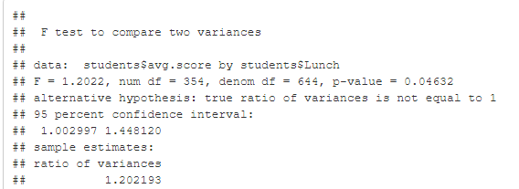

```{r setup, include=FALSE}
knitr::opts_chunk$set(echo = TRUE)
```

```{r}
library(dplyr)
library(tidyr)
library(ggplot2)
library(tidyverse)
library(ggpubr)
library(naniar)
library(knitr)
```

```{r}

#Import data
dt = read.csv("./data/StudentsPerformance.csv", header = TRUE)
head(dt)

```

```{r}
students <- dt %>% 
  pivot_longer(cols = c(math_score, reading_score, writing_score), names_to = "subject", values_to = "score") %>% 
  separate(subject, c("subject",NA))
students
```
```{r}
#Tên các biến
names(dt)

#Kiểu dữ liệu từng biến
sapply(dt, class)
```

# 1. Tóm tắt (abstract)

* Giáo dục là động lực quan trọng thúc đẩy sự phát triển và tiến bộ không ngừng của xã hội loài người. Với mức sống ngày càng được nâng cao, việc giáo dục của con người ngày càng trở nên cấp thiết hơn. Vì vậy, đi đôi với phát triển kinh tế, giáo cũng là một yếu tố quan trọng cấu thành nên sự phát triển của mỗi quốc gia.

* Nhóm đã sử dụng các phương pháp như phân tích dữ liệu, vẽ biểu đồ thống kê và quan sát trên ngôn ngữ R, từ đó đưa ra những nhận xét trực quan xung quanh vấn đề giáo dục.

* Nhìn chung, kết quả dự đoán so với kết quả thực tế thì có sự sai lệch nhất định, nhưng sự sai lệch đó không nhiều. Từ đó có thể kết luận, giáo dục có thể dựa trên những phương tiện nhất định (không phải là tất cả).

# 2.Giới thiệu (introduction)

* Cụm từ “học sinh - sinh viên” đã không quá xa lạ đối với xã hội hiện nay. Học sinh - sinh viên là những đối tượng đang được hướng dẫn dưới sự giáo dục của nhà trường và gia đình.

* Học sinh - sinh viên là những đối tượng tạo nên tương lai của đất nước. Đi kèm với đó là những thành tích mà các bạn đạt được thông qua các kỳ thi, là nơi mà các bạn thể hiện được kết quả học tập của bản thân. Đó cũng là chủ đề của nhóm em. 

* Nhằm mục tiêu nghiên cứu các yếu tố xung quanh có ảnh hướng đến đến thành tích của học sinh - sinh viên hay không? Từ việc thu thập thành tích và các yếu tố liên quan, từ đó đưa ra kết luận và đưa ra giải pháp để nâng cao giáo dục thời nay.

# 3. Dữ liệu (data)

* Dữ liệu trên gồm tập hợp của các bộ dữ liệu được thu thập từ các trường cấp 3 và một số trường đại học. Với 5 biến, tổng 1000 quan sát để làm yếu tố, giải thích cho thành tích của học sinh - sinh viên và 4 biến (math_score, reading_score, writing_score, total_score)là biến để biểu diễn thành tích cuối cùng đạt được của học sinh- sinh viên.

 * Mô tả và ý nghĩa:
      * gender: giới tính.              
      * race/ethnicity: chủng tộc / dân tộc.
      * parental_level_of_education: Trình độ học vấn gia đình.
      * lunch: Ăn trưa trước khi vào kỳ thi.
      * test_preparation_course: Tham gia các khóa luyện thi trước kỳ thi.
      * math_score: điểm toán.
      * reading_score: điểm đọc.
      * writing_score: điểm viết.
      * total_score: điểm trung bình. (Giúp dễ dàng hơn trong việc trực quan hóa dữ liệu)

# 4. Trực quan hóa dữ liệu (data visulization)

## 4.1. Chỉ số điểm trung bình xét trên các nhóm dân tộc

```{r}
ggplot(data = dt, mapping = aes(x = (math_score+reading_score+writing_score)/3)) +
	geom_histogram() +
	facet_wrap( ~ race.ethnicity, ncol = 2)

```

* dựa vào biểu đồ trên chúng ta có thể thấy dân tộc nhóm C có số điểm trung bình cao nhất, sau đó đến nhóm D, nhóm B 

* Ngược lại nhóm A có số điểm trung bình thấp nhất Và tiếp tục trên đó là nhóm E

## 4.2. Chỉ số điểm trung bình xét trên các nhóm luyện thi

```{r}
ggplot(data = dt, mapping = aes(x = (math_score+reading_score+writing_score)/3)) +
  geom_histogram() +
  facet_wrap( ~ test_preparation_course, ncol = 2)
```

* Theo như biểu đồ trên chúng ta có thể thấy những sinh viên tham gia khóa học luyện thi và hoàn thành khóa học luyện thi cho hầu như đều vượt qua kì thi với một số điểm trung bình cao 

* còn những sinh viên không tham gia khóa học luyện thi thì số lượng điểm trung bình thấp và rớt ở kì thi

## 4.3. Chỉ số điểm trung bình xét trên trình độ của cha mẹ sinh viên

```{r}
ggplot(data = dt, mapping = aes(x = (math_score+reading_score+writing_score)/3)) +
  geom_histogram() +
  facet_wrap( ~ parental_level_of_education , ncol = 3)
```

* Ta có thể thấy nhóm sinh viên có cha mẹ là thạc sĩ rất ít nhưng nhìn vào điểm trung bình thì tỉ lệ điểm rất là cao 

* nhóm sinh viên có cha mẹ có bằng cử nhân, bằng cao đẳng liên kết(associate's degree), bằng trung học phổ thông thì lượng điểm trung bình của sinh viên nằm ở tầm trung là nhiều nhất

* nhóm sinh viên có cha mẹ có bằng cao đẳng, bằng của một số trường cấp 3(some high school) thì điểm trung bình ở mức trung là cao nhất, nhưng cũng có phần lớn sinh viên điểm trung bình rất thấp.

# 5. Mô hình hóa dữ liệu(data modeling)

## Liner Regression

### Thống kê tất cả các biến số có trong tập dữ liệu và đưa ra sự chênh lệch giữa các nhóm với nhau.

* Biến dự đoán (X): gender, race/ethnicity, test_preparation_course, lunch, parental_level_of_education.

* Biến giải thích(Y): gender, race/ethnicity, test_preparation_course, lunch, parental_level_of_education.

* Ý nghĩa: Việc thống kê các quan sát của các biến giúp ta thấy được mức độ chênh lệch giữa các giá trị trong cùng 1 biến, điều này giúp ta thấy rõ hơn được giữa các giá trị sẽ ảnh hưởng đến phân vùng mật độ như thế nào

* Biểu đồ có thể sử dụng : Biểu đồ cột, (có thể sử dụng thêm biểu đồ mật đồ population mean)

* Phương pháp sử dụng: Thống kê và mô tả.

### Phân tích các yếu tố có ảnh hưởng đến thành tích? Đâu là những yếu tố ảnh hưởng lớn nhất?

* Biến dự đoán (X): gender, race/ethnicity, test_preparation_course, lunch, parental_level_of_education.

* Biến giải thích (Y): total_score, math_score, reading_score, writing_score

* Ý nghĩa: từ việc phân tích tổng quan, trực quan hóa trên biểu đồ các yếu tố ảnh hưởng đến thành tích, từ đó đưa ra kết luận các yếu tố tác 
động lớn nhất đến kết quả đạt được. 

* Biểu đồ có thể sử dụng: cột

* Phương pháp sử dụng: Thống kê mô tả, Thống kê phân tích (Mô tả và phân tích 2 biến phân loại của các biểu đồ, hoặc các biến phân loại trên từng điểm thành phần).

### Mối quan hệ giữa các biến khác với test_preparation_course trong tập dữ liệu?

* Biến dự đoán (X): gender, race/ethnicity, lunch, parental_level_of_education.

* Biến giải thích (Y): test_preparation_course

* Ý nghĩa: Phân tích các yếu tố xung quanh làm cho học sinh - sinh viên không thể tham gia được các khóa luyện thi, từ đó đưa ra giải pháp giúp học sinh - sinh viên có môi trường tốt hơn để học tập.

* Biểu đồ có thể sử dụng: cột

* Phương pháp sử dụng: Phân tích và mô tả.

# 6. Thực nghiệm, kết quả và thảo luận (experiments, results, and discussions)

## 6.1. Dự đoán tổng điểm dùng Linear Regression

```{r}

```

* Ta thấy được các biến chúng ta muốn dự đoán đều có p-value < 0.05 vì vậy các biến trên có ảnh hưởng đáng kể đến tổng điểm của học sinh.Và giá trị R^2 của là 0.9808 , giá trị này rất tốt và điều đó có nghĩa là mô hình của chúng ta có thể dự đoán tổng điểm tốt. Ngoài ra, giá trị này còn có nghĩa là các yếu tố dự đoán giải thích được 86,9% độ biến thiên của tổng điểm.

* Nhóm em dùng RMSE để kiểm tra hiệu suất của mô hình xây dựng được 

```{r}

```
```{r}

```

* Root Mean Square Error (RMSE) hoặc Root Mean Square Deviation (RMSD) là căn bậc hai của mức trung bình của các sai số bình phương. RMSE là độ lệch chuẩn của các phần dư (sai số dự đoán). RMSE cho biết mức độ phân tán các giá trị dự đoán từ các giá trị thực tế. RMSE càng thấp, mô hình và dự đoán của nó càng tốt

* Quan sát kết quả ta thấy kết quả RMSE của tập dữ liệu train và test đều thấp . Điều này cho thấy model dự đoán tốt.

* Tiếp theo sẽ kiểm tra mô hình có tuyến tính không. Để kiểm tra thì ta xem xét phần dư nếu có phương sai không đổi,phần dư có trị trung bình bằng 0 và không có tương quan giữa các phần dư.

```{r}

```
```{r}

```
```{r}

```
```{r}

```

* Quan sát các biểu đồ trên, ta thấy đối với biểu đồ Normal P-P Plot, các điểm dữ liệu trong phân phối của phần dư bám sát vào đường chéo vì vậy phần dư có phân phối chuẩn và các trị phần dư phân tán ngẫu nhiên quanh giá trị zero (đường ngang) thì phương sai không thay đổi. Như vậy ta có thể kết luận Mô hình tuyến tính.

```{r}
include_graphics("./image/2.png")
```

* Qua quan sát từ biểu đồ trên, ta thấy kết quả dự đoán được từ Multiple Regression khá sát với thực tế.

## 6.2. Dùng mô hình RANDOM FOREST để tìm xem đâu là biến quan trọng nhất gây tác động đến điểm số của học sinh.

* Mô hình RANDOM FOREST là một thuật toán phân loại bao gồm nhiều cây quyết định. Nó sử dụng tính năng đóng gói và tính năng ngẫu nhiên khi xây dựng từng cây riêng lẻ để cố gắng tạo ra một rừng cây không tương quan mà dự đoán của ủy ban chính xác hơn dự đoán của bất kỳ cây riêng lẻ nào.

```{r}

```
* Respect.unordered.factors giúp ranger mã hóa một cách an toàn và có ý nghĩa các biến phân loại dưới dạng số. Mã hóa này chạy nhanh hơn chuyển đổi biến phân loại thành biến chỉ báo..

* Dự đoán bằng mô hình RANDOM FOREST
```{r}

```

* Dữ liệu dự đoán được còn thiếu chính xác so với dữ liệu thực tế.

```{r}

```

* Xem xét mức độ quan trọng của các biến và đưa ra kết quả KẾT LUẬN qua phân tích và quan sát cho thấy biến Lunch/Bữa trưa (tiêu chuẩn/giảm) có tầm quan trọng nhất so với bất kỳ biến số nào khác, biến Lunch đã cho thấy tầm quan trọng nhất của mình bởi nó là yếu tố thể hiện kinh tế của gia đình và thể hiện 1 góc độ khả năng chi trả của phụ huynh để con của họ có thể được học trong một môi trường giáo dục tốt, đồng thời phản ánh đến sức khoẻ, một học sinh có một bữa ăn đầy đủ để đảm bảo sức khoẻ học tập và không cần phải suy nghĩ nhiều đến vấn đề kinh tế gia đình thì sẽ tập trung cho việc học của học sinh hơn. Biến giới tính có ít tầm quan trọng nhất.

## 6.3. Mục đích của phân tích này là xem liệu có mối quan hệ đáng kể nào giữa dân tộc, trình độ học vấn của cha mẹ với điểm kiểm tra hay không

### 6.3.1.Đăt giả thiết: 
### H0: Không có sự khác biệt thống kê về trung bình điểm môn toán giữa mỗi dân tộc.
### H1: Có sự khác biệt thống kê về trung bình điểm môn toán giữa mỗi dân tộc. 
### Mức ý nghĩa: 0.05 (Tương đương khoảng tin cậy 95%)

```{r}

```

* Bằng cách nhìn vào khung dữ liệu và trực quan hóa ở trên chúng ta có thể thấy rằng có một sự khác biệt nhỏ về giá trị trung bình giữa mỗi nhóm

* Để biết sự khác biệt giữa mỗi nhóm có nhiều không chúng ta cần phải sử dụng kiểm tra thống kê

```{r}

```

* Nhìn vào kết quả trên, chúng ta chỉ có được thông tin chung, còn cần biết giá trị p để so sánh với mức ý nghĩa, và xem có cần bác bỏ H0 hay không.

```{r}

```

* Giá trị p nhỏ hơn ngưỡng thông thường là 0,05 nên chúng tôi bác bỏ H0. Từ đó có thể xác định có sự khác biệt thống kê giữa trung bình điểm toán trong mỗi sắc tộc chủng tộc.

### 6.3.2.Điểm môn toán so với trình độ học vấn của cha mẹ

```{r}

```

* Dựa vào biểu đồ trên chúng ta có thể thấy trình độ học vấn của cha mẹ ảnh hưởng đến điểm môn toán như thế nào

  Đặt giá thiết:
  H0: Không có sự khác biệt về trung bình điểm môn toán giữa các bậc học của cha và mẹ                                                           H1: Có sự khác biệt về trung bình điểm môn toán giữa các bậc học của cha mẹ
  
```{r}
include_graphics("./image/10.png")
``` 

* Giá trị p < 0,05, do đó bác bỏ giả thiết H0.Có sự khác biệt đáng kể về điểm trung bình môn toán giữa trình độ học vấn của cha mẹ. Ví dụ, những học sinh có cha mẹ có bằng thạc sĩ đạt điểm môn toán cao hơn đáng kể so với những học sinh có cha mẹ chỉ mới tốt nghiệp trung học. Nhưng trình độ học vấn của cha mẹ không phải là yếu tố duy nhất vì còn có yếu tố khác như sắc tộc.

* Điểm môn Toán so với Trình độ học vấn của cha mẹ và Chủng tộc Dân tộc

```{r}

```

* Giá trị p < 0.05 do đó bác bỏ giả thiết H0.Có một tác động đáng kể giữa điểm toán và trình độ học vấn của cha mẹ cũng như điểm toán và chủng tộc.

* Điểm môn toán so với sự kết hợp giữa trình độ học vấn của cha mẹ và chủng tộc

```{r}
include_graphics("./image/12.png")
```

* Giá trị p < 0.05 do đó bác bỏ giả thiết H0.Có một tác động đáng kể từ sự kết hợp giữa trình độ học vấn của cha mẹ và sắc tộc chủng tộc đối với điểm môn toán.

* Kết luận cuối cùng: Dựa vào những phân tích và đánh giá từ trên xuống chúng ta có thể thấy điểm số kiểm tra của môn toán cao hay thấp của mỗi sinh viên có liên quan đến quan hệ đáng kể giữa dân tộc, trình độ học vấn của cha mẹ

## 6.4. Mục đích của công việc phân tích này là tìm hiểu xem liệu có mối quan hệ đáng kể nào giữa giới tính, thu nhập của cha mẹ và điểm kiểm tra hay không.

### 6.4.1.Mối quan hệ giữa giới tính và điểm thi 

```{r}

```

* Học sinh nam có điểm trung bình môn Toán cao hơn và học sinh nữ có điểm trung bình môn Đọc và Viết cao hơn.Để tìm hiểu sự phân bố điểm của học sinh, nhóm chúng em chia khoảng điểm thành các khoảng 10 điểm và vẽ biểu đồ phân phối của học sinh dưới dạng biểu đồ histogram.

```{r}

```

* Quan sát ở phổ điểm môn toán, từ những thang điểm cao từ 70 đến 100 điểm, tỉ lệ học sinh nam đạt điểm cao này nhiều hơn ở học sinh nữ và ngược lại ở hai môn đọc và viết thì từ thang điểm 70 đến 100 thì học sinh nữ dẫn đầu suy ra: Tỉ lệ học sinh nam đứng đầu môn Toán cao, tỉ lệ học sinh nữ đứng đầu môn Đọc và Viết cao.

* Nó có thể là kết quả của sự khác biệt về số lượng học sinh, vì vậy nhóm chúng em đã so sánh số lượng học sinh nam và nữ.

```{r}

```

* Học sinh nữ chiếm 51,8% và học sinh nam chiếm 48,2%, không có sự khác biệt có ý nghĩa thống kê giữa học sinh nam và nữ. Một bài kiểm tra nên được tiến hành để xác định xem sự khác biệt về điểm trung bình giữa học sinh nam và nữ được xác định trước đó có đáng kể hay không.

* Kiểm định phương sai bằng nhau được thực hiện trước kiểm định t.

* Đặt giả thuyết H0: có sự khác biệt về kết quả học tập của sinh viên theo môn học theo giới tính H1: không có sự khác biệt về kết quả học tập của sinh viên theo môn học theo giới tính.

```{r}

```

* p-value = 9.12e-08 chênh lệch trung bình điểm toán giữa nhóm nữ và nhóm nam không bằng 0 Khoảng tin cậy 95 phần trăm: -6.952285 -3.237737 trung bình điểm toán trong nhóm nữ trung bình điểm toán trong nhóm nam 63.63320 68.72822

```{r}

```

* p-value = 4.681e-15 chênh lệch trung bình điểm đọc giữa nhóm nữ và nhóm nam không bằng 0 Khoảng tin cậy 95 phần trăm: 5.375946 8.894212 trung bình điểm đọc trong nhóm nữ trung bình điểm đọc trong nhóm nam 72.60811 65.47303.

```{r}

```

* p-value < 2.2e-16 chênh lệch trung bình điểm viết giữa nhóm nữ và nhóm nam không bằng 0 Khoảng tin cậy 95 phần trăm: 7.35558 10.95638 trung bình điểm toán trong nhóm nữ trung bình điểm toán trong nhóm nam 72.46718 63.31120

* Trong cả ba trường hợp, giá trị p rất nhỏ nên giả thuyết không có thể bị bác bỏ. Vì vậy, có thể thấy sự khác biệt về kết quả học tập của sinh viên theo môn học theo giới tính là một sự khác biệt đáng kể.

### 6.4.2.Mối quan hệ giữa thu nhập của cha mẹ và điểm kiểm tra

```{r}

```
```{r}

```
```{r}
include_graphics("./image/21.png")
```

* Người ta thấy rằng điểm viết, điểm toán và điểm đọc đều có phân phối cao trong “tiêu chuẩn”(Lunch_standard). Để tìm hiểu xem những khác biệt này có đáng kể hay không, một bài kiểm tra t-test đã được tiến hành trên biến mean.score, là điểm trung bình của từng môn học trong số ba môn học của sinh viên.

* Trước khi thử nghiệm t-test , một thử nghiệm phương sai bằng nhau đã được thực hiện. Đặt giả thuyết H0: Phương sai của hai nhóm standard và free/reduced là như nhau H1: Phương sai của hai nhóm standard và free/reduced là khác nhau

```{r}

```

* Vì giá trị p của kết quả Kiểm tra F < 0,05 nên giả thuyết H0 có thể bị bác bỏ. Do đó, có thể thấy phương sai của hai nhóm là khác nhau.Dựa trên những kết quả này, một bài kiểm tra t-test khác được thực hiện.

* Đặt giả thuyết: H0: Thu nhập của cha mẹ không liên quan đến điểm số của học sinh H1: Thu nhập của cha mẹ có liên quan đến điểm số của học sinh

```{r}

```

* Vì giá trị p < 2.2e-16 là rất nhỏ nên có thể bác bỏ giả thuyết H0 Do đó, sự khác biệt về kết quả học tập trung bình của học sinh theo thu nhập của phụ huynh có thể được coi là một sự khác biệt đáng kể.

* Thông qua trực quan hóa dữ liệu, chúng em đưa ra giả thuyết rằng học sinh nữ có kỹ năng ngôn ngữ (đọc và viết) tốt hơn học sinh nam và học sinh nam có kỹ năng toán học tốt hơn học sinh nữ.Mối quan hệ giữa trình dộ học vấn và thu nhập của cha mẹ đối với điểm các môn toán, đọc, viết.

* Kiểm định t-test cho thấy có mối quan hệ đáng kể giữa thu nhập của cha mẹ và điểm số của học sinh. Nhóm chúng em cho rằng điều này cũng có thể được coi là thực tế là học sinh từ các gia đình có thu nhập thấp không được tạo cơ hội giáo dục bình đẳng.

* Qua phân tích ta thấy rằng điểm số của con cái của cha mẹ có trình độ học vấn cao là tương đối cao và điều này là do kinh nghiệm và sự quan tâm, dạy dỗ truyền đạt của cha mẹ đối với giáo dục lên con cái của họ đã ảnh hưởng đến điểm số của con cái họ.

* Qua việc phân tích các yếu tố giới tính, thu nhập và trình độ của cha mẹ có liên quan đến điểm các môn của học sinh thì nhóm chúng em đã có được giải pháp rằng: 
  + Về giới: việc các học sinh Nam chiếm ưu thế về điểm môn Toán hơn các học sinh nữ và ngược lại thì ta có thể khai khác các điểm mạnh , tiềm năng về lĩnh của các em học sinh và đưa ra giải pháp giáo dục phù hợp và hiệu quả 
  + Về thu nhập của cha mẹ: ta thấy rằng qua phân tích và trong thực tế ở giai đoạn hiện nay việc thu nhập của một hộ gia đình ở mức trun bình hoặc thấp sẽ ảnh hưởng đến kết quả học tập của các em học sinh, chính vì vậy chúng ta cần giải quyết vấn đề kinh tế, học phí và bữa ăn học đường của các học sinh sinh viên, các quỹ học bổng và bảo trợ học sinh sinh viên để đảm bảo được sự bình đẳng trong giáo dục. 
  +Về trình độ học vấn của phụ huynh: quá rõ ràng sau khi phân tích ta thấy rằng việc phụ huynh học sinh có trình độ dân trí cao hơn thì con của họ cũng có tỉ lệ đạt thành tích học tập tốt hơn, họ quan tâm và truyền đạt kiến thức kinh nghiệm và văn hoá để giáo dục con em của họ tốt hơn. Cho nên đối với những bậc phụ huynh tuy có những trình độ khác nhau nhưng việc cải thiện dân trí và sự quan tâm cho các con em của họ là điều hoàn toàn có thể, để góp phần nâng cao học thức và dân trí, gia đình có dân trí cao thúc đẩy các con em có ý thức trong việc học tập hơn và góp phần nâng cao dân trí trong xã hội.


# 7. Kết luận (conclusions)
* Qua phần trực quan hóa dữ liệu (data visulization), chúng ta có thể thấy được các yếu tố: dân tộc, giới tính, trình độ học vấn của cha mẹ, việc tham gia huấn luyện trước kì thi có mối liên hệ với điểm số của học sinh. Đặc biệt biến Lunch đã cho thấy tầm quan trọng nhất của mình bởi nó là yếu tố thể hiện kinh tế của gia đình và thể hiện 1 góc độ khả năng chi trả của phụ huynh để con của họ có thể được học trong một môi trường giáo dục tốt, đồng thời phản ánh đến sức khoẻ, một học sinh có một bữa ăn đầy đủ để đảm bảo sức khoẻ học tập và không cần phải suy nghĩ nhiều đến vấn đề kinh tế gia đình thì sẽ tập trung cho việc học của học sinh hơn.

* Qua hai mô hình dùng để dự đoán điểm số , mô hình Linear Regression và mô hình Random Forest, kết quả của hai mô hình có độ chính xác khá cao so với thực tế.

*	Sử dụng ngôn ngữ R và thư viện cần thiết để trực quan hoá dữ liệu, các hàm tính toán, phân tích, trực quan bằng biểu đồ.

*	Áp dụng kiến thức môn học trên lớp.

*	Áp dụng hồi quy tuyến tính, Random Forest để xây dựng mô hình dự đoán được điểm số của học sinh dựa vào các yếu tố ảnh hưởng tìm thấy..

*	Sau quá trình nghiên cứu nhóm em đã thấy được có mốt số yếu tố có ảnh hưởng đến điểm số của học sinh , ta có thể dựa vào những yếu tố này để giúp gia tăng điểm sô của các học sinh đang có điểm số thấp . Tuy nhiên để có thể dự đoán được chính xác thì vẫn còn cần tìm kiếm những yếu tố khác nữa để có thể gia tăng khả năng dự đoán chính xác hơn.

*	Nếu có nhiều thời gian hơn, nhóm chúng em sẽ tìm kiếm thêm các yếu tố có thể ảnh hưởng đến điểm số của học sinh và áp dụng thêm các mô hình, thuật toán để có nhiều kết luận và dự đoán thực tế và chính xác hơn.

# 8. Đóng góp (contributions)
### Trần Minh Duy - 20133032
### Ngô Văn Khánh - 20133054 
### Cao Trọng Nghĩa - 20133071 
### Lê Tuấn Nghĩa - 20133072

# 9. Tham khảo (references)

* Thầy Quách Đình Hoàng. Linear Regression. Khóa học 'Lập trình R cho phân tích'. 2022

* [KR] Student Performance in Exam 시각화 & 검정. : https://www.kaggle.com/code/junhwan26/kr-student-performance-in-exam

* PREDICTION USING RANDOM FOREST MODEL. https://www.kaggle.com/code/muktapathak/prediction-using-random-forest-model

* Students Performance. https://www.kaggle.com/code/elvisampah25/students-performance

* Statistical & Hypothesis Testing With R. https://www.kaggle.com/code/dodyharianto/statistical-hypothesis-testing-with-r

* R - Multiple Regression. Tutorialspoint.com. 2020. https://www.tutorialspoint.com/r/r_multiple_regression.htm


